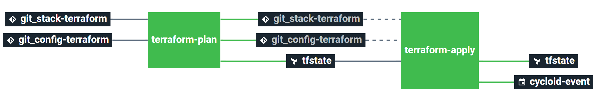
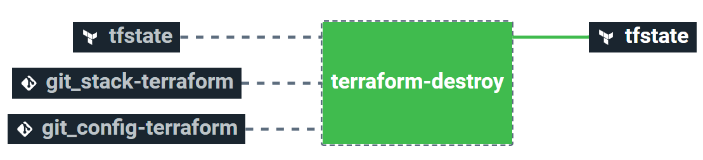

# Stack-VMware

<p align="center">

</p>

## Stack description

This Stack will create a Virtual Machine (or VM) on your VMware ESXi infrastructure from scratch (via an ISO file).

### Additional informations

  - This Stack uses the ```StackForms``` feature, which allows you to configure your Stack (and your VM) via a user-friendly form
  - This Stack works via an **ESXi (not managed by a vCenter)** connection
  - This Stack use the [VMware vSphere Terraform Provider](https://registry.terraform.io/providers/hashicorp/vsphere/latest/docs) (by default on the latest version, here *2.0.2*)

### Known limitations 

  - The ESXi use case have a lower version of the vSphere provider (in *terraform/esxi-iso/versions.tf* file) specified at **1.15.0**. This is due to a known [bug](https://github.com/hashicorp/terraform-provider-vsphere/issues/1033) which will be fixed in the next release of the provider
  
  - The default Terraform backend is configured to AWS

## Requirements

In order to run this Stack, couple elements are required :

  - Having an S3 bucket to store Terraform remote state
  - Having a user which is able to create a virtual machine from API calls  

## Pipeline views

### Overview 



#### Jobs description

 - ```terraform-plan``` : Terraform job that will simply make a plan of the infrastructure's stack. It is automatically triggered upon resources changes
 - ```terraform-apply``` : Terraform job similar to the plan one, but will actually create/update everything that needs to. Please see the plan diff. for a better understanding. It is automatically triggered upon tfstate file changes after terraform-plan job completes

### Destroy



#### Job description

 - ```terraform-destroy``` ⚠️ : Terraform job meant to destroy the VM created - **NO CONFIRMATION ASKED**. Need to be triggered manually. Use with caution


## How to use this Stack

  - Add your ESXi credentials in the Cycloid console
  - Create a project and select this Stack
  - Create your environment 
  - Use StackForms interface for configuring your environment
  - Wait for the terraform plan to launch automatically or launch it manually


## Stack details

### StackForms fields/params

#### ESXi-ISO use-case (create a VM from an ISO)

| Name                    | Description                                                   |   Type    |                              Default                              | Required |
|-------------------------|---------------------------------------------------------------|:---------:|:-----------------------------------------------------------------:|:--------:|
| `esxi_hostname`         | Needed to find the default resource pool for ESXi connection. | `string`  |                           `sd-150734.`                            |  `True`  |
| `vm_cpu`                | Number of CPU allocated to the virtual machine                | `integer` |                                `2`                                |  `True`  |
| `vm_disk_size`          | Disk size allocated to the virtual machine (Go)               | `integer` |                               `20`                                |  `True`  |
| `vm_iso`                | Path to ISO file needed to bootstrap the virtual machine      | `string`  |              `ISOs/debian-9.13.0-amd64-netinst.iso`               |  `True`  |
| `vm_memory`             | Memory allocated to the virtual machine (Mo)                  | `integer` |                              `2048`                               |  `True`  |
| `vm_name`               | Name of the virtual machine                                   | `string`  | `($ organization_canonical $)-($ project $)-($ environment $)-vm` |  `True`  |
| `esxi_datacenter`    | Datacenter where to create the virtual machine                | `string`  |                               `dc1`                               |  `True`  |
| `esxi_datastore`     | Datastore where to create the virtual machine                 | `string`  |                           `datastore1`                            |  `True`  |
| `esxi_datastore_iso` | Datastore where the ISO file will be located                  | `string`  |                           `datastore1`                            |  `True`  |
| `esxi_network`       | Cluster where to create the virtual machine                   | `string`  |                           `VM Network`                            |  `True`  |
